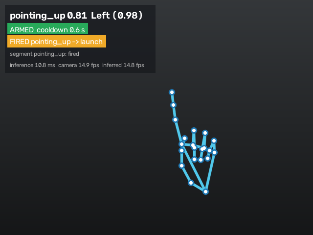
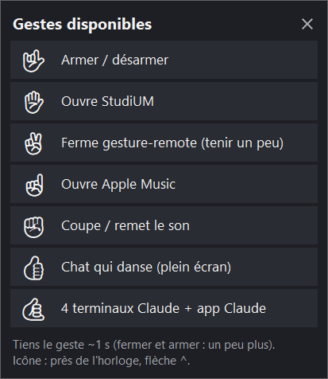

# gesture-remote

Control your Windows PC with hand gestures in front of the webcam: open an app or a web page,
run one of your Python macros, press keys, even teach it your own gestures.
100 % local and free: no cloud, no API key. Webcam frames stay in memory and are never saved or
logged.

<p>
  
  
</p>

*Left: the debug window (hand skeleton, recognised gesture, armed state, last action).
Right: the popup that lists the available gestures, shown at start and from the tray menu.*

## How it works

webcam → [MediaPipe](https://ai.google.dev/edge/mediapipe) gesture recognizer (7 built-in
gestures, plus yours through a small scikit-learn model on the hand landmarks) → a state machine
that fires once per gesture (stable for ~1 s, cooldown, 🤟 arms/disarms) → the action bound in
`config.yaml`.

| Action type | Example in `config.yaml` |
|---|---|
| `url` | `open_palm: { type: url, url: "https://example.com" }` |
| `launch` | `pointing_up: { type: launch, app: "Apple Music" }` (Start-menu name, `app_id:` or `path:`) |
| `keys` | `closed_fist: { type: keys, keys: [volumemute] }` (`repeat_while_held: true` for volume) |
| `script` | `thumb_up: { type: script, path: macros/fullscreen_gif.py }` |
| `quit` | `victory: { type: quit }` closes gesture-remote |

Any action takes an optional `label: "..."`: the text the gestures popup shows.
`config.yaml` is reloaded automatically when saved.

## Setup (Windows, Python 3.13)

```powershell
py -3.13 -m venv .venv
.\.venv\Scripts\python -m pip install --upgrade pip
.\.venv\Scripts\python -m pip install -e ".[dev]"
.\.venv\Scripts\python tools\download_models.py   # MediaPipe models, SHA-256 checked
.\.venv\Scripts\python tools\check_setup.py       # models, camera
```

Always use `.venv\Scripts\python`: a bare `python` may be the Microsoft Store alias.
To reproduce the exact tested versions: `.\.venv\Scripts\python -m pip install -r requirements.lock`.

## Run

```powershell
.\.venv\Scripts\python -m gesture_remote --debug --dry-run   # debug window, actions only logged
.\.venv\Scripts\python -m gesture_remote --debug             # for real, with the debug window
```

### In the background (tray icon, no console)

```powershell
.\.venv\Scripts\python tools\make_shortcut.py             # Desktop + Start menu (Windows search)
.\.venv\Scripts\python tools\make_shortcut.py --startup   # ...and start with Windows
.\.venv\Scripts\python tools\make_shortcut.py --remove    # delete every shortcut
```

The shortcut runs `pythonw -m gesture_remote --tray`. The icon near the clock (often behind the
`^` arrow) is green when armed, red when disarmed. Its menu: show the camera window (or
double-click the icon), the gestures popup, edit `config.yaml`, open the log, quit. Only one copy
runs at a time.

## Your own gestures

Besides the 7 built-in gestures, you can teach it yours. Quit the tray app first if the camera
does not open.

```powershell
.\.venv\Scripts\python tools\record.py call_me   # hold the gesture ~10 s, move your hand a little
.\.venv\Scripts\python tools\record.py call_me   # a 2nd recording: gives a real accuracy score
.\.venv\Scripts\python tools\record.py none      # relaxed hand / typing: fewer false triggers
.\.venv\Scripts\python tools\train.py            # prints the accuracy, saves models\custom_gestures.joblib
```

Then bind it in `config.yaml` (`call_me: { type: url, url: "https://..." }`) and restart the app.
Only the hand's landmark numbers are saved (`data\`, never committed), never an image. A custom
gesture is used only when the built-in model sees no built-in gesture, and only at or above
`settings.recognition.custom_min_score` (0.8). Without a trained model, bindings to custom
gestures are skipped with a warning, so a fresh clone still starts.

## Macros

A macro is a Python script in `macros/`, bound with `{ type: script, path: macros/my_macro.py }`.
It runs with the project's Python in its own process, without a window; its `print()` output goes to
`logs/scripts/<name>.log`. Only one instance of a given script runs at a time. Examples:
`fullscreen_gif.py` (plays `macros/media/cat_dance.gif` full screen; bring your own GIF),
`claude_setup.py` (four terminal tabs running `claude`, plus the Claude app).

To find the Start-menu name or AppID of an app for `{ type: launch, app: "..." }`:
`.\.venv\Scripts\python tools\check_setup.py --apps music`.

## Tests

```powershell
.\.venv\Scripts\python -m pytest
.\.venv\Scripts\python -m ruff check .
```

Architecture, conventions and known traps: `CLAUDE.md`.

## License

MIT, see `LICENSE`.
